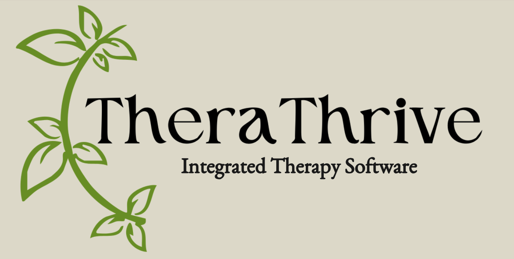
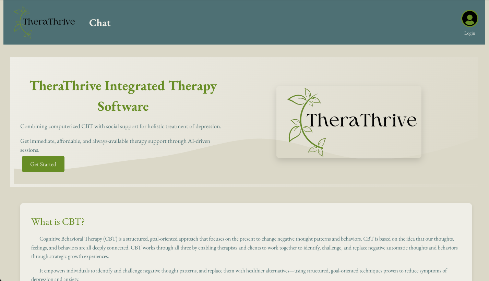
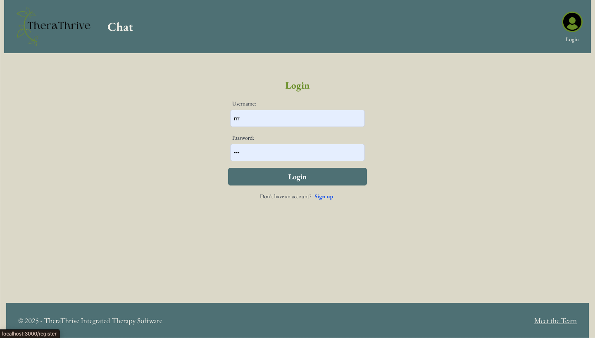
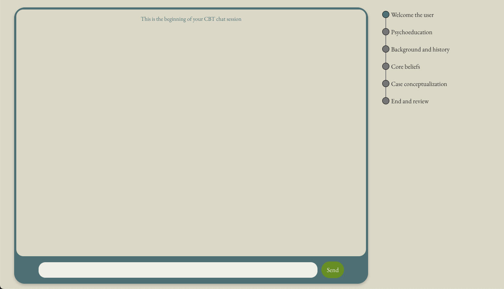
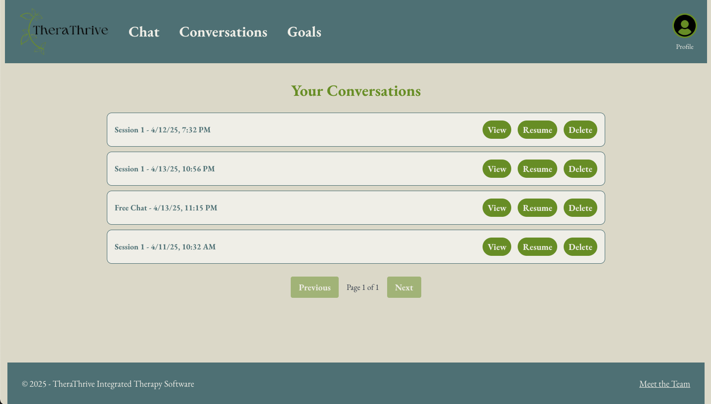
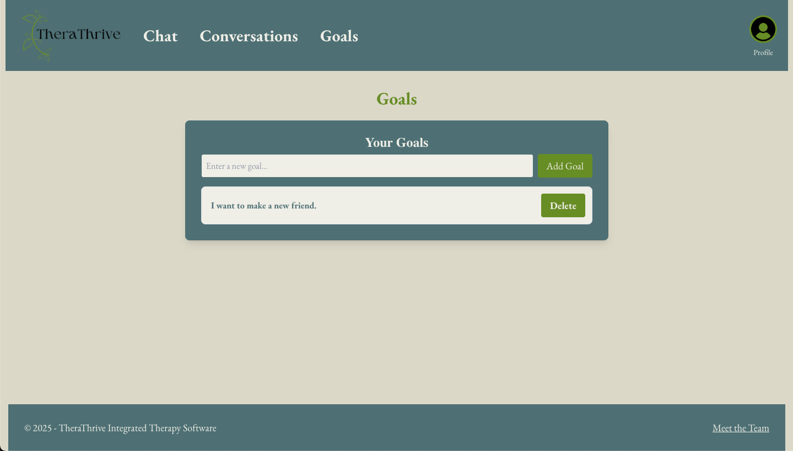

# User Manual

This page will show you how to use TheraThrive. 

TheraThrive is a Cognitiva Behavioral Therapy (CBT) platform where users can sign in and complete sessions of CBT on their own time, for free. Below will be a guide of how to get started.

## FAQ

- Q: Is this chatbot a replacement for a therapist? 
    - A: No, it is a support tool and not a licensed mental health provider. It's best used as a supplement to professional therapy.

- Q: How long is a typical session?
    - A: Sessions are flexible—usually between 15-60 minutes depending on how much you want to engage. TheraThrive works best when the user is willing to engage fully.

- Q: Can the chatbot recognize when someone is at risk? What if I’m in crisis or need urgent help?
    - A: It will recognize concerning language and suggest resources, but it is not capable of full risk assessment or intervention. If you're in crisis, please contact a local crisis line or emergency services immediately.

- Q: Can I delete my data or chat history?
    - A: Absolutely. You can delete past sessions at any time from the conversations page.

- Q: Is my conversation with the TheraThrive chatbot pivate?
    - A: Yes, your conversation with the chatbot can only be accessed by your account. Please note, this chatbot uses the OpenAI API, and all of your messages may be used by OpenAI for training purposes. Please do not enter any Personally Identifiable Information or similar sensitive information.

## Sign In or Register

From our home page, you canfind the user icon and login button on the top right of the screen. Click this button to be take to the login screen

At the sign in screen, you will be prompted for a username and password. If you have not signed in before, you will need to select the 'Sign up' link at the bottom of the page to register as a new user. Either sign in or create a new account before moving on to the next steps. Users that are not signed in will not be able to access certain pages or features

## Start Your First Chat

Once signed in, you can select the chat window from the header to start a CBT conversation. From there, you will have two options: an unstructured free chat or a CBT session.

### Free Chat

Free chat is an all purpose mental health therapy chat that adheres to the same guidelines as our CBT sessions. This chat is designed to have no agenda, allowing the user to discuss any therapy-related topic they want, includng asking questions about the CBT process. 

### CBT Sessions

All of our CBT sessions have a predefined agenda. The chatbot will take the user through the agenda items one-by-one in the order it sees as the most appropriate. Within each agenda item, the chatbot has multiple topics it will work through with the user before moving on. The overall session progress can be seen outside of the chat window to the right. The user is welcome to discuss anything therapy-related they would like, but the chatbot will attempt to guide the conversation back toward the agenda tasks when the discussion goes off topic.

## Conversations

When a user eners a conversation, that conversation is automatically saved to the users account. Previous conversations can be accessed from this page. The user can view the conversation only, resume the chat, or delete the conversation from their account. 

## Goals

The goals page is designed to allow a user to save goals they want to set for themselves. These goals can be personal, or can be suggested by the chatbot during the CBT sessions. The user an enter a goal in the text box and pres the 'Add Goal' button to save the goals to their account.

